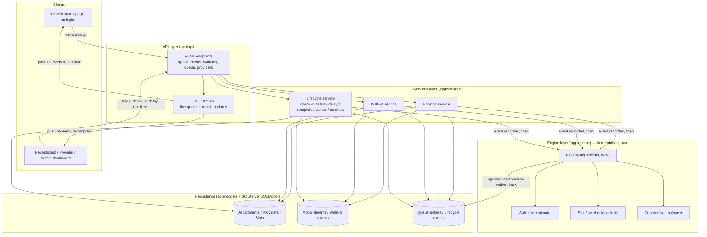
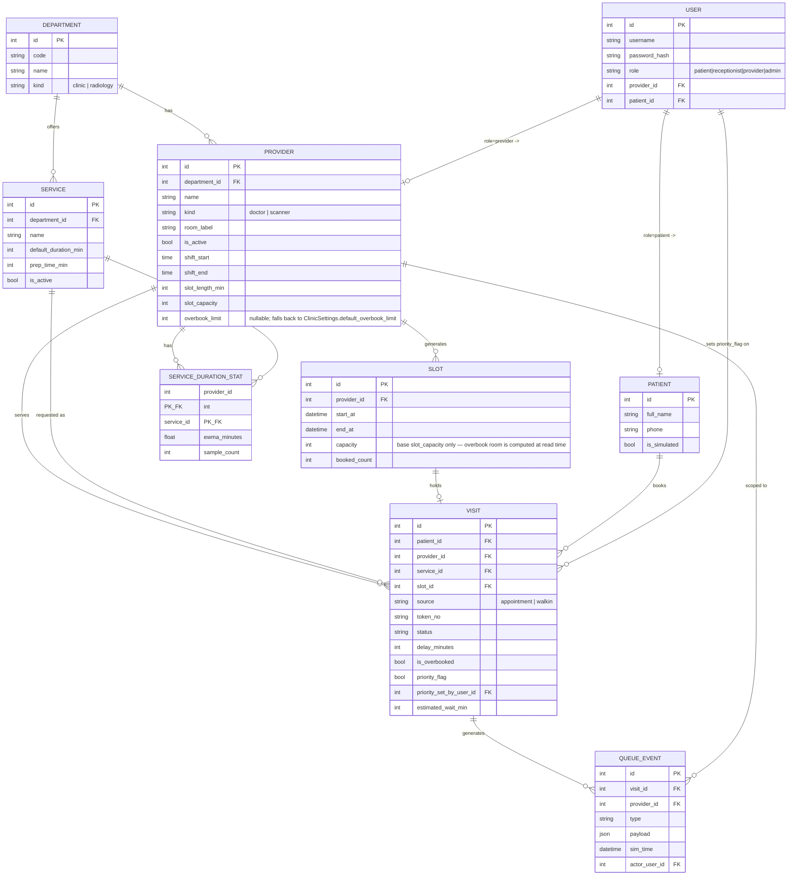

# System Architecture

## 1. Architecture Overview

MediQ is a single-service backend (FastAPI) organized into four layers, with one shared queue engine serving all four departments (General Medicine, Ophthalmology, Paediatrics, Radiology). There is no per-department engine — departments differ only in configuration (providers, service durations, overbooking limits), not in logic.



## 2. Components

| Component | Responsibility | Technology |
|---|---|---|
| Frontend | Patient status page, receptionist/provider/admin dashboard | React + Vite + Tailwind CSS (`/frontend`, added after API stabilizes) |
| Backend — API | Request validation, routing, SSE stream | FastAPI |
| Backend — Services | Use-case orchestration (book, walk-in, lifecycle transitions) | Python |
| Backend — Engine | Deterministic recompute, wait-time estimation, overbooking limits, load balancing | Python (pure functions, no I/O) |
| Database | Departments, providers, slots, appointments, tokens, queue entries, events | SQLite via SQLModel |
| AI / ML | Not used — operational scheduling only, no clinical inference | — |
| External API | None | — |

## 3. Data Flow — Event-Driven Design

Every state-changing action in MediQ is modeled as one of a fixed set of **events**: `book`, `walk_in`, `check_in`, `start`, `delay`, `complete`, `cancel`, `no_show`, `priority_set`. A recompute additionally logs `eta_changed` for any visit whose estimate actually moved — see § 8.

The rule is always the same, regardless of which event fired:

1. A service function (`app/services/`) validates the request and writes the resulting state change — a new/updated `Appointment`, `WalkInToken`, or `QueueEntry` row, plus an immutable `LifecycleEvent` record for audit/history.
2. The service then calls **`recompute(provider, now)`** in `app/engine/` for the affected provider.
3. `recompute` is the single deterministic entry point for all queue math: it re-derives queue order, applies slot/overbooking limits, re-balances load across counters where a department has more than one provider (e.g. Radiology's scanners), and recalculates the estimated wait time for every remaining entry in that provider's queue.
4. The recomputed state is written back to `QueueEntry` rows and pushed to connected clients over the SSE stream, so the patient status page and staff dashboard update live without polling.

Because `recompute` always takes `(provider, now)` and reads only persisted state, its output is a pure function of "what has happened so far" — the same event history always reproduces the same queue state. This is what makes a delay or no-show scenario propagate correctly: a `delay` event doesn't special-case downstream entries; it just triggers the same `recompute`, which naturally pushes out every wait estimate behind it.

### Wait-time estimation approach

Each provider gets one timeline, built fresh on every recompute from whoever's currently in service plus everyone still waiting. The full placement algorithm, its reason codes, and the auto-no-show rule are in § 8 below.

### Simulated clock

For demo purposes, `now` is not always the wall clock: `app/core` exposes a simulated clock that can be advanced explicitly (e.g. "jump 20 minutes" to show a delay's downstream effect without waiting in real time). All engine and service logic consumes `now` as a parameter rather than calling the system clock directly, so the same code path runs identically against the real clock in normal operation and the simulated clock in a demo.

## 4. Security / Privacy Considerations

### RBAC (Module M2)

Four roles: `patient`, `receptionist`, `provider` (doctor/technician), `admin`.
`GET /api/departments`-style catalog reads, the public token status page, and the
SSE stream are ungated (no login); every other endpoint requires a bearer token and
enforces its documented role — see `docs/api-contract.md` for the full table.

- **Login** (`POST /api/auth/login`) checks the username/password with `bcrypt`
  (`app/core/security.py`) and returns a signed JWT (HS256). Wrong password, unknown
  username, and a deactivated account all return the exact same `401
  invalid_credentials` response — revealing *why* a login failed is itself a user-
  enumeration leak, so the API doesn't distinguish them. The login handler always
  runs a bcrypt comparison, even for an unknown username (against a fixed dummy
  hash), so a lookup miss doesn't return measurably faster and leak account
  existence through response timing.
- **Tokens** carry only `sub` (user id) plus `iat`/`exp` — never role or provider/
  patient id. `get_current_user` (`app/api/deps.py`) re-reads the user row from the
  database on every request, so role changes or deactivation take effect on the
  user's very next request rather than only after their token expires.
- **`require_roles(*roles)`** is a dependency factory: each router builds one
  module-level dependency per permission set (e.g. `require_staff = require_roles(
  RECEPTIONIST, ADMIN)`) and attaches it via `Depends(...)`, or via `dependencies=`
  at the `APIRouter` level when an entire router (`/admin`, `/sim`) is admin-only.
- **Object-level scope** goes beyond role: `ensure_provider_scope` confines a
  `provider` user to their own `provider_id`'s queue; `ensure_visit_provider_scope`
  and `ensure_visit_patient_scope` do the same for a specific `Visit` (looked up via
  `get_visit_or_404`, so an unknown `visit_id` is `404`, not `403`). Receptionists
  and admins are unrestricted by these checks. These are real, tested checks now
  (Module M2), even though the lifecycle/booking *business logic* they guard is
  still a Module M3/M6 placeholder — the ownership check runs before the
  `not_implemented` response.
- **Secrets:** `JWT_SECRET_KEY` comes from the environment only; `Settings`
  (`app/core/config.py`) refuses to start with an empty key unless
  `ENVIRONMENT=development`, so a misconfigured non-dev deployment fails loudly at
  startup instead of silently signing tokens with a known default.

### Other considerations

- **No clinical inference:** priority is either default queue order or a status set explicitly by staff/simulation. No endpoint accepts or infers priority from symptoms — this is an operational scheduling system, not a triage system.
- **Data minimization:** demo data is synthetic (see `backend/app/seed/`); no real patient data is collected or stored.
- **Input validation:** all API boundaries use Pydantic schemas (`app/schemas/`); the engine and persistence layers never receive unvalidated request data directly.

## 5. Architecture Diagram

The Mermaid diagram above is the source of truth. Before final submission, it will be exported as a static image to:

`docs/architecture.png`

The diagram should match the implemented system rather than an aspirational design — update it as modules land.

## 6. Data Model (Module M1)



No relationships are declared at the ORM level (SQLModel `Relationship()`); callers join explicitly by foreign-key id. `Visit` intentionally has no symptom or clinical field — `priority_flag`/`priority_reason` may only be set by an authorized staff user (`priority_set_by_user_id`) or the demo simulator. `ClinicSettings` and `SimClock` are single-row configuration tables (id fixed to `1`) and are omitted from the diagram above since they don't participate in any relationship.

## 7. Simulation and Test Console (development tool)

`GET /console` serves a single-page developer console (`backend/app/console/`: plain HTML/CSS/JS, no build step, no CDN dependency) for exercising and demoing the backend from a browser instead of `curl`/Swagger. It is **not** part of the patient/staff product — it is scaffolding for building and demoing MediQ itself, and it only ever calls the real, public `/api/*` surface documented in `docs/api-contract.md` (no backdoor endpoints), so it always tests exactly what the real frontend will use.

It is deliberately tolerant of the current state of the backend, most of which is still a Module M1 placeholder:

- A `501` response is rendered as an informational "not implemented yet" badge, never as an error.
- The live queue board's SSE connection (`/api/stream`) shows a **Live** / **Reconnecting** / **Unavailable** indicator, since that endpoint is itself still a placeholder today.
- The scripted **scenario runner** (morning rush, delay, no-show) reports each step as `pass`, `fail`, or `skipped: not implemented`, so a scenario that depends on an unbuilt endpoint degrades visibly instead of erroring out.

As placeholder endpoints are replaced module by module, the console needs no changes — it starts rendering real data the moment an endpoint stops returning `501`.

Two small additions to the API surface were made specifically to support this console (both still `501` placeholders, landing for real in Module M8): `POST /api/sim/freeze` and `POST /api/sim/resume`, wrapping the already-implemented `app.core.clock.freeze`/`unfreeze` (see `docs/api-contract.md` § Simulation).

## 8. Queue Engine (Module M6)

`app/engine/` is a pure, framework-free module: plain dataclasses in (`EngineInput`), plain dataclasses out (`EngineResult`) — no database session, no wall clock. `app/services/queue_service.py` is the only caller: it loads a provider's current state from the database, calls `app.engine.run()`, and persists the result. `app/services/lifecycle_service.py` validates and applies each state transition, then calls `queue_service.recompute_provider()` so the effect is immediate.

### Duration estimation

```
expected_duration = (learned EWMA if sample_count >= 3, else service.default_duration_min) + service.prep_time_min
```

The learned average (`ServiceDurationStat.ewma_minutes`, keyed by `(provider_id, service_id)`) is updated on `complete`: `ewma_minutes = alpha * actual_minutes + (1 - alpha) * ewma_minutes` (seeded directly from the first sample instead of blending against 0). `actual_minutes` is `completed_at - started_at` minus `prep_time_min`, so the learned figure stays comparable to `default_duration_min` — prep time is added back on top by the formula above either way. Radiology services use this identical formula; only the numbers configured on the `Service` row differ (e.g. CT: 30 min default + 15 min prep = 45 min).

### The provider timeline

One cursor, one pass, in this order:

1. **In-service visit sets the cursor.** `expected_end = started_at + expected_duration + delay_minutes`. If `now` is already past that, the provider is overrunning: assume it finishes in `max(2, 25% of expected_duration)` more minutes rather than trusting an estimate reality has already disproved.
2. **Auto-no-show.** Any `BOOKED` visit whose `scheduled_start + noshow_grace_minutes` (default 10, `ClinicSettings.noshow_grace_minutes`) has passed is excluded from the timeline and reported back to `queue_service`, which marks it `NO_SHOW` with a `QueueEvent`. A `CHECKED_IN` visit never auto-expires — it already arrived.
3. **Priority visits go first**, in the order they were flagged (`priority_set_at`), each placed right at the cursor. Priority is exclusively a staff action (`POST /visits/{id}/priority`, non-empty reason required) or the demo simulator — never inferred from symptoms.
4. **Appointments anchor to their own time**: `start = max(cursor, scheduled_start + delay_minutes)`, processed in `scheduled_start` order. Two appointments anchored to the same slot (overbooking) simply queue one after the other.
5. **Walk-ins fill gaps.** In arrival order, each walk-in takes the earliest gap between two already-placed blocks that it fits inside without spilling into the next block (which would push that appointment later than it would otherwise start) — otherwise it goes after the last block. A `delay` on a waiting visit (appointment or walk-in) defers its own earliest-eligible time the same way.
6. Every placement gets `estimated_start`, `estimated_end`, `estimated_wait_min = max(0, estimated_start - now)`, `expected_delay_min = max(0, estimated_start - scheduled_start)` (`0` for walk-ins, which have no schedule to be measured against), a position, and a reason (below).

### ETA reason codes

Generated by comparing the new `estimated_start` against the visit's previous one (`Visit.estimated_start` before this recompute). Checked in this order; the first match wins — with several true simultaneously, the most informative one is reported rather than every contributing factor:

| Condition | Reason text |
|---|---|
| This visit is the one just placed by priority | `Priority patient placed ahead (set by staff)` |
| Pulled earlier, and a walk-in filled a newly-opened gap | `Filled a gap left by an earlier no-show` |
| Pulled earlier, and a no-show is known to have freed the slot | `no-show at HH:MM freed the slot` |
| Pulled earlier, no no-show this round | `an earlier slot became available` |
| The in-service visit has `delay_minutes > 0` | `delay logged by provider` |
| The in-service visit is organically overrunning (no explicit delay) | `consultation ahead overran` |
| This visit itself has `delay_minutes > 0` | `delay logged (<reason>)` |
| A priority visit exists ahead of it | `priority patient placed ahead of you` |
| None of the above, and it's running behind its own schedule (`expected_delay_min > 0`) | `Running <N> min behind schedule` |
| None of the above, and it's on schedule | `On schedule` |

A non-zero change with a real prior estimate to compare against is prefixed with the
signed delta, e.g. `+15 min: delay logged by provider` or `-10 min: no-show at 10:20
freed the slot`. The last two rows (no specific cause found) deliberately do **not**
get a delta prefix even when one exists — a delta there would just be clock drift
against whatever baseline happened to be stored last (e.g. from the seed's initial
recompute), not a real queue event, so the text describes the current state
directly instead of manufacturing a misleading "+2 min: ...".

### Delayed, load, and privacy

A visit counts as **delayed** in queue summaries (`delayed_count`) if `delay_minutes > 0` or its `expected_delay_min > 10` — a fixed display threshold, independent of `noshow_grace_minutes` even though both happen to default to 10. **Load** is simply the number of active visits for a provider (in-service, if any, plus everyone waiting).

**Privacy:** `GET /api/queue/providers/{id}` shows `patient_name` as first name + last initial only (e.g. "Ravi K.") — this is a shared queue-board display, not a private record, even though the endpoint itself is staff-only. `GET /api/status/{token_no}` (public, no login) goes further and omits the name entirely, along with anything else not already summarized in § "Queue and status" of `docs/api-contract.md`.

## 9. Booking and Capacity (Module M3)

### Slot generation

`app/services/slot_service.py::ensure_slots_for_date(provider, date)` is idempotent:
if any `Slot` rows already exist for that `(provider, date)`, it returns them
unchanged; otherwise it walks the provider's shift (`shift_start` → `shift_end`)
in `slot_length_min` steps and creates one row per step. It's called from both
`GET /api/providers/{id}/slots` (on demand, whichever date is asked for) and the
seed script (for today and tomorrow), so there's exactly one code path for "what a
provider's slots for a day look like."

`Slot.capacity` stores the provider's **base** `slot_capacity` only — it never
bakes in `overbook_limit`. Overbook room is always computed at read/booking time
from whichever `overbook_limit` is *current* (the provider's, or
`ClinicSettings.default_overbook_limit` if the provider's is `null`) via
`slot_service.effective_overbook_limit()`. This means changing a provider's
`overbook_limit` later doesn't require regenerating already-created slots — every
read recomputes `remaining_with_overbook` fresh.

### Capacity, overbooking, and atomicity

`app/services/booking_service.py::create_appointment()` validates (patient,
provider, service-belongs-to-department, slot-belongs-to-provider,
slot-hasn't-ended, no-overlapping-active-visit-for-this-patient) with ordinary
`SELECT`s, then claims capacity with a single statement:

```sql
UPDATE slots SET booked_count = booked_count + 1
WHERE id = :slot_id AND booked_count < :capacity + :overbook_limit
```

SQLite serializes writers, so this `UPDATE`'s `WHERE` is evaluated against
whatever `booked_count` is *at that instant* — not a value read moments earlier —
so two concurrent bookings against the same slot can never both push `booked_count`
past the limit; the loser's `UPDATE` matches zero rows and the booking is rejected
with `409 conflict`. `Visit.is_overbooked` is then simply `booked_count > capacity`
(base) after the increment. The capacity claim, the token allocation, and the
`Visit` insert all happen before the one `session.commit()` — a crash or a token
collision partway through rolls back the whole attempt, never leaving a claimed
slot with no matching visit.

### Token numbering

`app/services/tokens.py::create_visit_with_token()` numbers per
`(department, source, day)` — e.g. `GM-A013` is General Medicine's 13th
*appointment* token that day; `RAD-W005` is Radiology's 5th *walk-in*. The number
is `count of existing visits for that key that day, plus one`. If the insert hits
the `Visit.token_no` unique constraint (a concurrent request just took that
number), the attempt is rolled back via a `SAVEPOINT` (`session.begin_nested()`,
so only the failed insert is undone, not the capacity claim already made in the
same transaction) and retried with the *next* number — not a fresh re-count, since
the failed attempt was never persisted and would just hand back the identical,
already-taken number again.

## 10. Load-Balanced Routing (Module M4)

`POST /api/walk-ins` with no `provider_id` (and `ClinicSettings.walkin_routing_enabled`
true) routes via `app/services/walkin_service.py::choose_provider()`:

1. For every active provider in the requested department, build the same
   `EngineInput` `queue_service.recompute_provider()` would use, but with one
   extra hypothetical `WaitingVisit` (the walk-in being created) appended — then
   run the pure engine (`app.engine.run()`) and read that hypothetical visit's
   `estimated_wait_min`. **Nothing is written to the database** for the providers
   not chosen; `run_engine()` is a pure function, so evaluating it per candidate
   has no side effects to undo.
2. Sort candidates by `(hypothetical_wait, active_visit_count, provider_id)` —
   shortest wait wins; ties broken by whoever currently has fewer active visits,
   then by lower `provider_id` for full determinism.
3. The winner's `routing_explanation` compares it against the runner-up, e.g.
   `"Routed to Dr. Rao: shortest wait (12 min vs 27 min)"`. With only one active
   provider in the department there's nothing to compare against, so it reads
   `"only active provider in department"` instead of fabricating a comparison. An
   explicit `provider_id` skips routing entirely and reads `"requested by
   receptionist"`.

The chosen routing outcome — provider and explanation — is stored in the
`walk_in` `QueueEvent`'s payload, so `GET /api/events` can answer "why did this
walk-in land on this provider" after the fact, the same way `eta_changed` answers
"why did this estimate move."
