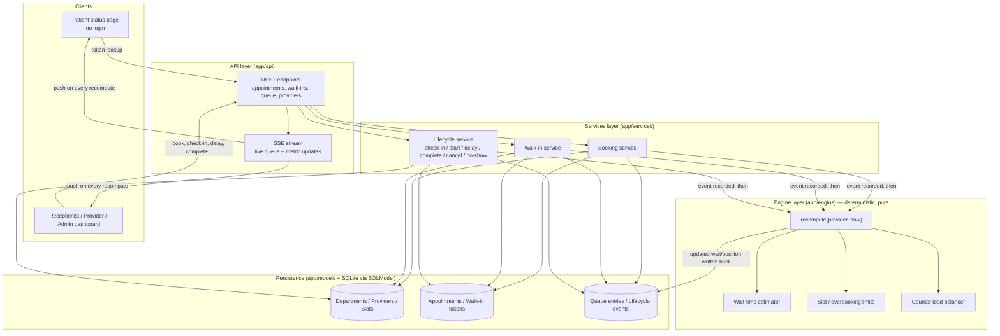
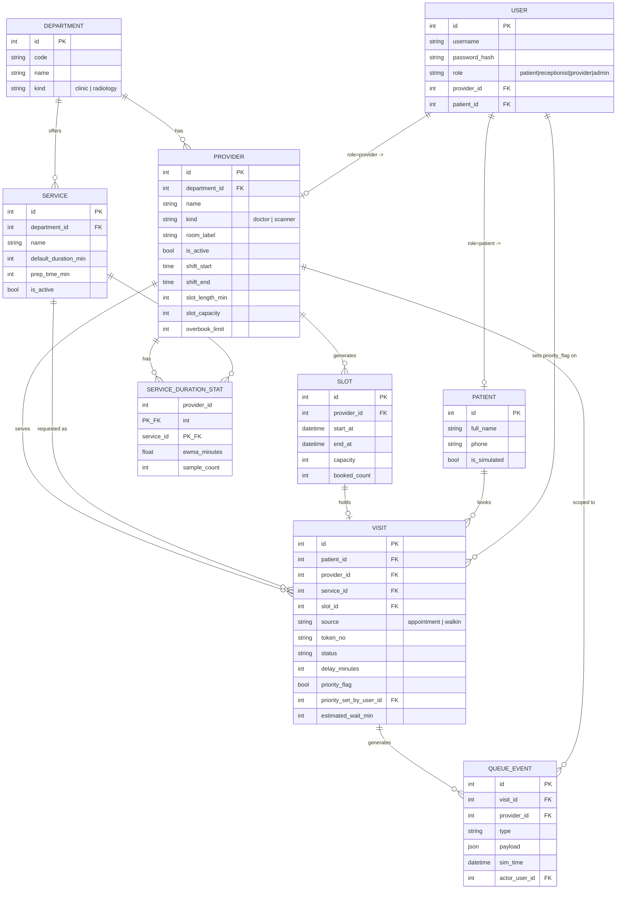

# System Architecture

## 1. Architecture Overview

MediQ is a single-service backend (FastAPI) organized into four layers, with one shared queue engine serving all four departments (General Medicine, Ophthalmology, Paediatrics, Radiology). There is no per-department engine — departments differ only in configuration (providers, service durations, overbooking limits), not in logic.



## 2. Components

| Component | Responsibility | Technology |
|---|---|---|
| Frontend | Patient status page, receptionist/provider/admin dashboard | React + Vite + Tailwind CSS (`/frontend`, added after API stabilizes) |
| Backend — API | Request validation, routing, SSE stream | FastAPI |
| Backend — Services | Use-case orchestration (book, walk-in, lifecycle transitions) | Python |
| Backend — Engine | Deterministic recompute, wait-time estimation, overbooking limits, load balancing | Python (pure functions, no I/O) |
| Database | Departments, providers, slots, appointments, tokens, queue entries, events | SQLite via SQLModel |
| AI / ML | Not used — operational scheduling only, no clinical inference | — |
| External API | None | — |

## 3. Data Flow — Event-Driven Design

Every state-changing action in MediQ is modeled as one of a fixed set of **events**: `book`, `walk_in`, `check_in`, `start`, `delay`, `complete`, `cancel`, `no_show`.

The rule is always the same, regardless of which event fired:

1. A service function (`app/services/`) validates the request and writes the resulting state change — a new/updated `Appointment`, `WalkInToken`, or `QueueEntry` row, plus an immutable `LifecycleEvent` record for audit/history.
2. The service then calls **`recompute(provider, now)`** in `app/engine/` for the affected provider.
3. `recompute` is the single deterministic entry point for all queue math: it re-derives queue order, applies slot/overbooking limits, re-balances load across counters where a department has more than one provider (e.g. Radiology's scanners), and recalculates the estimated wait time for every remaining entry in that provider's queue.
4. The recomputed state is written back to `QueueEntry` rows and pushed to connected clients over the SSE stream, so the patient status page and staff dashboard update live without polling.

Because `recompute` always takes `(provider, now)` and reads only persisted state, its output is a pure function of "what has happened so far" — the same event history always reproduces the same queue state. This is what makes a delay or no-show scenario propagate correctly: a `delay` event doesn't special-case downstream entries; it just triggers the same `recompute`, which naturally pushes out every wait estimate behind it.

### Wait-time estimation approach

For a given provider at time `now`, estimated wait for a queue entry is:

```
estimated_wait = sum(expected_service_duration(entry) for entry ahead in queue)
                 + max(0, provider.current_case_expected_end - now)
                 − load_balancing_adjustment (if the department has multiple interchangeable providers)
```

`expected_service_duration` comes from configurable per-department/per-service assumptions (e.g. a CT scan takes longer than a General Medicine consult, and includes prep time for scanners). Overbooked slots simply add more entries "ahead in queue" rather than being modeled specially. A `delay` event updates `provider.current_case_expected_end` directly, which is what causes downstream estimates to increase on the next recompute.

### Simulated clock

For demo purposes, `now` is not always the wall clock: `app/core` exposes a simulated clock that can be advanced explicitly (e.g. "jump 20 minutes" to show a delay's downstream effect without waiting in real time). All engine and service logic consumes `now` as a parameter rather than calling the system clock directly, so the same code path runs identically against the real clock in normal operation and the simulated clock in a demo.

## 4. Security / Privacy Considerations

### RBAC (Module M2)

Four roles: `patient`, `receptionist`, `provider` (doctor/technician), `admin`.
`GET /api/departments`-style catalog reads, the public token status page, and the
SSE stream are ungated (no login); every other endpoint requires a bearer token and
enforces its documented role — see `docs/api-contract.md` for the full table.

- **Login** (`POST /api/auth/login`) checks the username/password with `bcrypt`
  (`app/core/security.py`) and returns a signed JWT (HS256). Wrong password, unknown
  username, and a deactivated account all return the exact same `401
  invalid_credentials` response — revealing *why* a login failed is itself a user-
  enumeration leak, so the API doesn't distinguish them. The login handler always
  runs a bcrypt comparison, even for an unknown username (against a fixed dummy
  hash), so a lookup miss doesn't return measurably faster and leak account
  existence through response timing.
- **Tokens** carry only `sub` (user id) plus `iat`/`exp` — never role or provider/
  patient id. `get_current_user` (`app/api/deps.py`) re-reads the user row from the
  database on every request, so role changes or deactivation take effect on the
  user's very next request rather than only after their token expires.
- **`require_roles(*roles)`** is a dependency factory: each router builds one
  module-level dependency per permission set (e.g. `require_staff = require_roles(
  RECEPTIONIST, ADMIN)`) and attaches it via `Depends(...)`, or via `dependencies=`
  at the `APIRouter` level when an entire router (`/admin`, `/sim`) is admin-only.
- **Object-level scope** goes beyond role: `ensure_provider_scope` confines a
  `provider` user to their own `provider_id`'s queue; `ensure_visit_provider_scope`
  and `ensure_visit_patient_scope` do the same for a specific `Visit` (looked up via
  `get_visit_or_404`, so an unknown `visit_id` is `404`, not `403`). Receptionists
  and admins are unrestricted by these checks. These are real, tested checks now
  (Module M2), even though the lifecycle/booking *business logic* they guard is
  still a Module M3/M6 placeholder — the ownership check runs before the
  `not_implemented` response.
- **Secrets:** `JWT_SECRET_KEY` comes from the environment only; `Settings`
  (`app/core/config.py`) refuses to start with an empty key unless
  `ENVIRONMENT=development`, so a misconfigured non-dev deployment fails loudly at
  startup instead of silently signing tokens with a known default.

### Other considerations

- **No clinical inference:** priority is either default queue order or a status set explicitly by staff/simulation. No endpoint accepts or infers priority from symptoms — this is an operational scheduling system, not a triage system.
- **Data minimization:** demo data is synthetic (see `backend/app/seed/`); no real patient data is collected or stored.
- **Input validation:** all API boundaries use Pydantic schemas (`app/schemas/`); the engine and persistence layers never receive unvalidated request data directly.

## 5. Architecture Diagram

The Mermaid diagram above is the source of truth. Before final submission, it will be exported as a static image to:

`docs/architecture.png`

The diagram should match the implemented system rather than an aspirational design — update it as modules land.

## 6. Data Model (Module M1)



No relationships are declared at the ORM level (SQLModel `Relationship()`); callers join explicitly by foreign-key id. `Visit` intentionally has no symptom or clinical field — `priority_flag`/`priority_reason` may only be set by an authorized staff user (`priority_set_by_user_id`) or the demo simulator. `ClinicSettings` and `SimClock` are single-row configuration tables (id fixed to `1`) and are omitted from the diagram above since they don't participate in any relationship.

## 7. Simulation and Test Console (development tool)

`GET /console` serves a single-page developer console (`backend/app/console/`: plain HTML/CSS/JS, no build step, no CDN dependency) for exercising and demoing the backend from a browser instead of `curl`/Swagger. It is **not** part of the patient/staff product — it is scaffolding for building and demoing MediQ itself, and it only ever calls the real, public `/api/*` surface documented in `docs/api-contract.md` (no backdoor endpoints), so it always tests exactly what the real frontend will use.

It is deliberately tolerant of the current state of the backend, most of which is still a Module M1 placeholder:

- A `501` response is rendered as an informational "not implemented yet" badge, never as an error.
- The live queue board's SSE connection (`/api/stream`) shows a **Live** / **Reconnecting** / **Unavailable** indicator, since that endpoint is itself still a placeholder today.
- The scripted **scenario runner** (morning rush, delay, no-show) reports each step as `pass`, `fail`, or `skipped: not implemented`, so a scenario that depends on an unbuilt endpoint degrades visibly instead of erroring out.

As placeholder endpoints are replaced module by module, the console needs no changes — it starts rendering real data the moment an endpoint stops returning `501`.

Two small additions to the API surface were made specifically to support this console (both still `501` placeholders, landing for real in Module M8): `POST /api/sim/freeze` and `POST /api/sim/resume`, wrapping the already-implemented `app.core.clock.freeze`/`unfreeze` (see `docs/api-contract.md` § Simulation).
