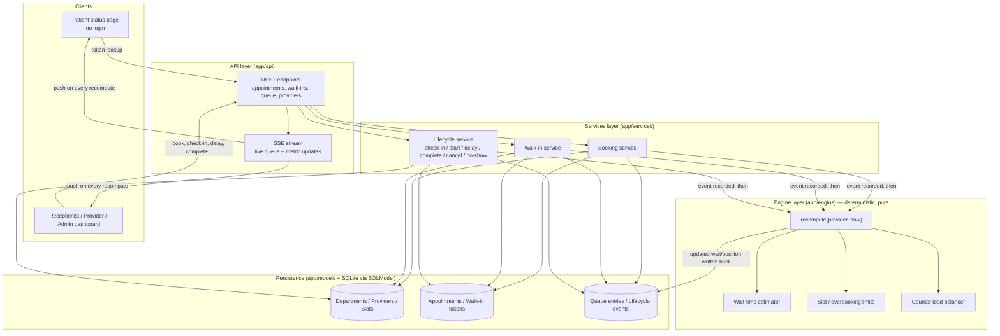

# System Architecture

## 1. Architecture Overview

MediQ is a single-service backend (FastAPI) organized into four layers, with one shared queue engine serving all four departments (General Medicine, Ophthalmology, Paediatrics, Radiology). There is no per-department engine — departments differ only in configuration (providers, service durations, overbooking limits), not in logic.



## 2. Components

| Component | Responsibility | Technology |
|---|---|---|
| Frontend | Patient status page, receptionist/provider/admin dashboard | React + Vite + Tailwind CSS (`/frontend`, added after API stabilizes) |
| Backend — API | Request validation, routing, SSE stream | FastAPI |
| Backend — Services | Use-case orchestration (book, walk-in, lifecycle transitions) | Python |
| Backend — Engine | Deterministic recompute, wait-time estimation, overbooking limits, load balancing | Python (pure functions, no I/O) |
| Database | Departments, providers, slots, appointments, tokens, queue entries, events | SQLite via SQLModel |
| AI / ML | Not used — operational scheduling only, no clinical inference | — |
| External API | None | — |

## 3. Data Flow — Event-Driven Design

Every state-changing action in MediQ is modeled as one of a fixed set of **events**: `book`, `walk_in`, `check_in`, `start`, `delay`, `complete`, `cancel`, `no_show`.

The rule is always the same, regardless of which event fired:

1. A service function (`app/services/`) validates the request and writes the resulting state change — a new/updated `Appointment`, `WalkInToken`, or `QueueEntry` row, plus an immutable `LifecycleEvent` record for audit/history.
2. The service then calls **`recompute(provider, now)`** in `app/engine/` for the affected provider.
3. `recompute` is the single deterministic entry point for all queue math: it re-derives queue order, applies slot/overbooking limits, re-balances load across counters where a department has more than one provider (e.g. Radiology's scanners), and recalculates the estimated wait time for every remaining entry in that provider's queue.
4. The recomputed state is written back to `QueueEntry` rows and pushed to connected clients over the SSE stream, so the patient status page and staff dashboard update live without polling.

Because `recompute` always takes `(provider, now)` and reads only persisted state, its output is a pure function of "what has happened so far" — the same event history always reproduces the same queue state. This is what makes a delay or no-show scenario propagate correctly: a `delay` event doesn't special-case downstream entries; it just triggers the same `recompute`, which naturally pushes out every wait estimate behind it.

### Wait-time estimation approach

For a given provider at time `now`, estimated wait for a queue entry is:

```
estimated_wait = sum(expected_service_duration(entry) for entry ahead in queue)
                 + max(0, provider.current_case_expected_end - now)
                 − load_balancing_adjustment (if the department has multiple interchangeable providers)
```

`expected_service_duration` comes from configurable per-department/per-service assumptions (e.g. a CT scan takes longer than a General Medicine consult, and includes prep time for scanners). Overbooked slots simply add more entries "ahead in queue" rather than being modeled specially. A `delay` event updates `provider.current_case_expected_end` directly, which is what causes downstream estimates to increase on the next recompute.

### Simulated clock

For demo purposes, `now` is not always the wall clock: `app/core` exposes a simulated clock that can be advanced explicitly (e.g. "jump 20 minutes" to show a delay's downstream effect without waiting in real time). All engine and service logic consumes `now` as a parameter rather than calling the system clock directly, so the same code path runs identically against the real clock in normal operation and the simulated clock in a demo.

## 4. Security / Privacy Considerations

- **RBAC (roles):** `patient` (no login — public token lookup only), `receptionist`, `provider` (doctor/technician), `clinic_admin`. Role checks gate write endpoints (booking, lifecycle transitions, configuration); the patient status page only ever exposes a token's own queue position/estimate, never other patients' data.
- **No clinical inference:** priority is either default queue order or a status set explicitly by staff/simulation. No endpoint accepts or infers priority from symptoms — this is an operational scheduling system, not a triage system.
- **Data minimization:** demo data is synthetic (see `backend/app/seed/`); no real patient data is collected or stored.
- **Input validation:** all API boundaries use Pydantic schemas (`app/schemas/`); the engine and persistence layers never receive unvalidated request data directly.
- **Secrets:** configuration is read from environment variables via `pydantic-settings`; no secrets are hardcoded or committed (see `.env.example`).

## 5. Architecture Diagram

The Mermaid diagram above is the source of truth. Before final submission, it will be exported as a static image to:

`docs/architecture.png`

The diagram should match the implemented system rather than an aspirational design — update it as modules land.
